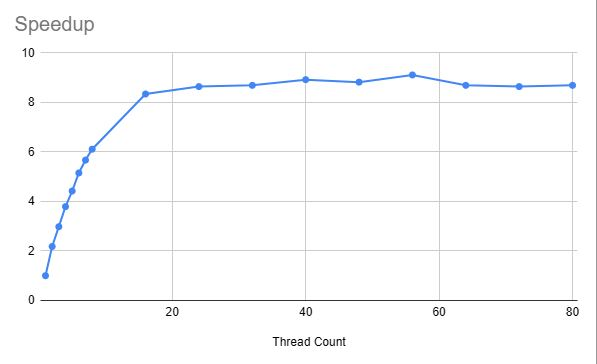

|Thread Count|Wall Clock Time|User Time|System Time|Speedup|
|:--:|--:|--:|--:|:--:|
|1|16.85|14.01| 0.57|1.00|
|2| 7.74|14.21| 0.55| 2.18|
|3| 5.65|15.12| 0.67| 2.98|
|4| 4.45|15.44| 0.78| 3.79|
|5| 3.81|15.87| 0.91| 4.42|
|6| 3.27|16.01| 0.95| 5.15|
|7| 2.97|16.28| 1.10| 5.67|
|8| 2.76|16.23| 1.28| 6.11|
|16| 2.02|17.57| 3.15| 8.34|
|24| 1.95|18.30| 6.76| 8.64|
|32| 1.94|17.82|12.06| 8.69|
|40| 1.89|16.94|22.91| 8.92|
|48| 1.91|16.91|27.76| 8.82|
|56| 1.85|16.78|31.47| 9.11|
|64| 1.94|16.95|23.39| 8.69|
|72| 1.95|17.22|18.79| 8.64|
|80| 1.94|17.02|29.32| 8.69|

1. More threads aren't necessarily better if there aren't enough cores/resources to support every thread at once. In this case, there will be time when there are threads waiting to run because other threads are currently using all the resources, or a specific resource a thread needs to continue. And if threads are waiting, it's not possible for the process to run any faster because the maximum amount of work that can be done in parallel is already being done.
